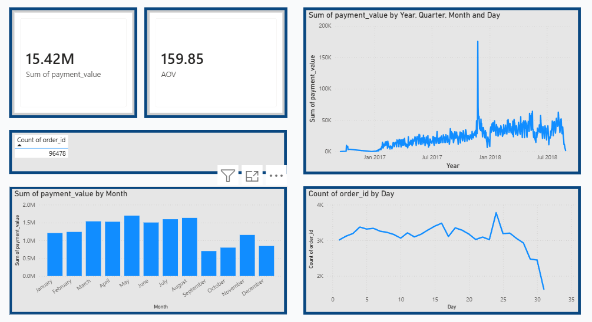
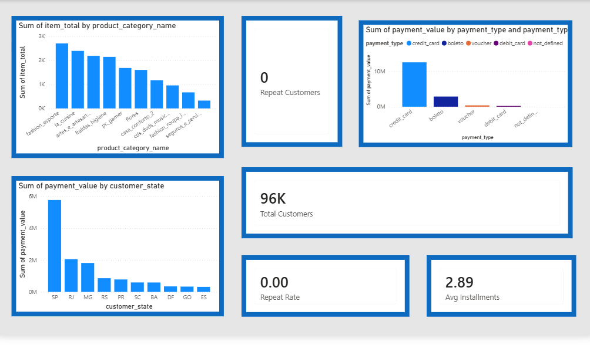
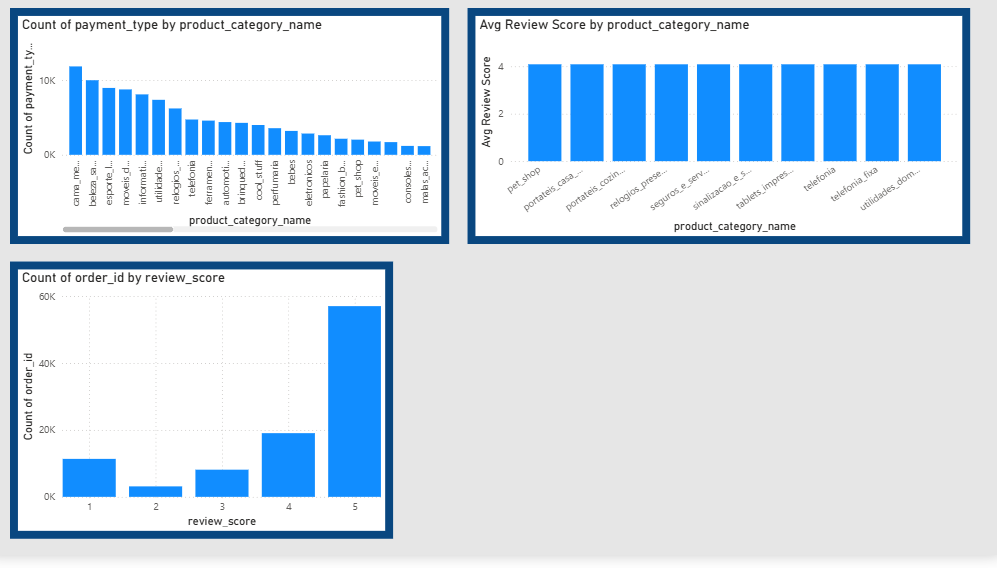

# 📊 Sales Data Analysis Dashboard (Power BI)

## 🔍 Overview

This project focuses on analyzing e-commerce sales data to understand business performance, customer behavior, and revenue trends.

The dashboard was built using **Power BI (DAX)**, with data cleaning done using **Python (Pandas)**.

---

## 📈 Dashboards

### 1. Sales & Performance Dashboard

* Tracks **Total Revenue, Orders, and Average Order Value (AOV)**
* Shows top-performing product categories
* Displays revenue distribution across states

---

### 2. Customer & Product Insights

* Analyzes **customer behavior and repeat customers**
* Shows product category performance
* Includes **review score analysis**

---

### 3. Time-Based Analysis

* Shows **revenue trends over time**
* Monthly and daily order patterns
* Helps identify peak sales periods

---

## 🧠 Key Insights

* Certain regions contribute significantly higher revenue
* A few product categories drive most of the sales
* Majority of customers give high review scores
* Sales show clear trends over months and days

---

## 🛠️ Tools Used

* Power BI (DAX, Data Modeling, Visualization)
* Python (Pandas)
* Excel / CSV

---

## ▶️ How to View

### Option 1 (Quick)

View the dashboards directly from the images above

### Option 2 (Power BI)

1. Download `sales_dashboard.pbix`
2. Open it using Power BI Desktop

---

## ⚠️ Note

The dataset was connected via **Power BI Service (Direct Lake)**, so it is not included in this repository.
Screenshots are provided to demonstrate the dashboard.

---

## 📌 Conclusion

This project demonstrates:

* Data analysis and KPI tracking
* Dashboard creation using Power BI
* Business-focused insights generation

---

## 🔗 Author

Roshani Priya
GitHub: https://github.com/roshni2154
LinkedIn:www.linkedin.com/in/roshani21

---

